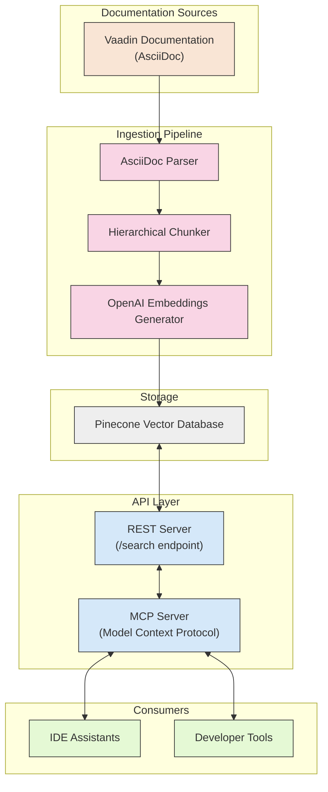

# Vaadin Documentation Assistant

This project provides a complete solution for ingesting, indexing, and retrieving Vaadin documentation through semantic search. It consists of two main components that work together to make Vaadin documentation easily accessible to developers and IDE assistants.

## Project Components

### 1. Documentation Ingestion Pipeline (`docs-ingestion/`)

The ingestion pipeline handles the process of extracting, processing, and indexing Vaadin documentation:

- Clones or pulls the latest Vaadin documentation from GitHub
- Parses and processes AsciiDoc files with custom front matter
- Implements a hierarchical chunking strategy for optimal retrieval
- Generates embeddings using OpenAI's text-embedding-3-small model
- Stores embeddings and metadata in Pinecone vector database
- Supports incremental updates to keep documentation current

### 2. REST Server (`rest-server/`)

The REST server provides an HTTP API for searching Vaadin documentation:

- Exposes a `/search` endpoint for querying documentation
- Connects to Pinecone vector database for semantic search
- Handles parameter validation and error handling
- Returns search results in JSON format

### 3. MCP Server (`mcp-server/`)

The Model Context Protocol (MCP) server provides a standardized interface for accessing the indexed documentation:

- Enables semantic search of Vaadin documentation via the REST server
- Integrates with IDE assistants through the Model Context Protocol
- Provides control over search parameters (results count, token limits)
- Runs as a standalone service that communicates via stdio

## How It Works

1. The ingestion pipeline processes Vaadin documentation and stores it in a Pinecone vector database
2. The REST server provides an HTTP API to search the Pinecone database
3. The MCP server forwards search requests to the REST server and formats the results
4. IDE assistants and tools can query the MCP server to get contextual Vaadin documentation



## Prerequisites

- [Bun](https://bun.sh/) runtime
- OpenAI API key (for embeddings)
- Pinecone API key and index

## Quick Start

1. Set up environment variables:
   ```bash
   # In docs-ingestion directory
   cp .env.example .env
   # Edit .env with your API keys

   # Create .env file in the root directory
   echo "OPENAI_API_KEY=your_openai_api_key" > .env
   echo "PINECONE_API_KEY=your_pinecone_api_key" >> .env
   echo "PINECONE_INDEX=your_pinecone_index" >> .env
   ```

2. Run the ingestion pipeline:
   ```bash
   cd docs-ingestion
   ./burn run ingest
   ```

3. Start the REST server:
   ```bash
   cd rest-server
   bun run start
   ```

4. Integrate with your IDE by adding the MCP server to your MCP settings file (locally).
    ```
    {
        "mcpServers": {
            "vaadin": {
                "command": "/full/path/to/bun",
                "args": [
                    "run",
                    "/full/path/to/vaadin-mcp/mcp-server/src/index.ts"
                ]
            }
        }
    }
    ```

## License

[MIT](docs-ingestion/LICENSE)
