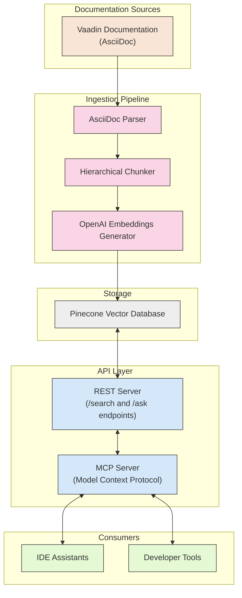

# Vaadin Documentation Assistant

This project provides a complete solution for ingesting, indexing, and retrieving Vaadin documentation through semantic search. It consists of two main components that work together to make Vaadin documentation easily accessible to developers and IDE assistants.

## Project Components

### 1. Documentation Ingestion Pipeline (`docs-ingestion/`)

The ingestion pipeline handles the process of extracting, processing, and indexing Vaadin documentation:

- Clones or pulls the latest Vaadin documentation from GitHub
- Parses AsciiDoc files with custom front matter
- Processes AsciiDoc content to Markdown using a custom approach:
  - Handles includes by manually processing them before conversion
  - Uses asciidoctor.js to handle conditionals and other directives
  - Converts to Markdown using downdoc
- Implements a semantic chunking strategy based on heading structure:
  - Preserves semantic units by keeping entire sections together
  - Chunks based on h2 level headings
  - Preserves document title and introduction as the first chunk
  - Maintains context by including document title in each chunk
  - Never breaks up code blocks
- Generates embeddings using OpenAI's text-embedding-3-small model
- Stores embeddings and metadata in Pinecone vector database
- Handles incremental updates by replacing documents from the same source
- Includes rate limiting and error handling for API calls

### 2. REST Server (`rest-server/`)

The REST server provides an HTTP API for searching Vaadin documentation:

- Exposes a `/search` endpoint for querying documentation
- Provides an `/ask` endpoint for AI-generated answers to Vaadin questions
- Connects to Pinecone vector database for semantic search
- Handles parameter validation and error handling
- Returns search results or AI-generated answers in JSON format

### 3. MCP Server (`mcp-server/`)

The Model Context Protocol (MCP) server provides a standardized interface for accessing the indexed documentation:

- Enables semantic search of Vaadin documentation via the REST server
- Integrates with IDE assistants through the Model Context Protocol
- Provides control over search parameters (results count, token limits)
- Runs as a standalone service that communicates via stdio

## How It Works

1. The ingestion pipeline processes Vaadin documentation and stores it in a Pinecone vector database
2. The REST server provides an HTTP API to search the Pinecone database and generate AI answers
3. The MCP server forwards search requests to the REST server and formats the results
4. IDE assistants and tools can query the MCP server to get contextual Vaadin documentation



## Prerequisites

- [Bun](https://bun.sh/) runtime
- OpenAI API key (for embeddings and AI answers)
- Pinecone API key and index

## Quick Start (Local Development)

1. Set up environment variables:
   ```bash
   # In docs-ingestion directory
   cp .env.example .env
   # Edit .env with your API keys

   # Create .env file in the root directory
   echo "OPENAI_API_KEY=your_openai_api_key" > .env
   echo "PINECONE_API_KEY=your_pinecone_api_key" >> .env
   echo "PINECONE_INDEX=your_pinecone_index" >> .env
   ```

2. Run the ingestion pipeline:
   ```bash
   cd docs-ingestion
   bun run src/index.ts
   ```

3. Start the REST server:
   ```bash
   cd rest-server
   bun run start
   ```

4. Integrate with your IDE by adding the MCP server to your MCP settings file (locally).
    ```
    {
        "mcpServers": {
            "vaadin": {
                "command": "/full/path/to/bun",
                "args": [
                    "run",
                    "/full/path/to/vaadin-mcp/mcp-server/src/index.ts"
                ]
            }
        }
    }
    ```

## Deployment Guide

This section outlines how to deploy each component of the Vaadin Documentation Assistant for production use.

### 1. Documentation Ingestion Pipeline (GitHub Actions)

The ingestion pipeline is configured to run as a scheduled GitHub Actions workflow:

1. The workflow is defined in `.github/workflows/docs-ingestion.yml`
2. It runs daily at 2 AM UTC to update the documentation
3. It can also be triggered manually via the GitHub Actions UI

To set up the GitHub Actions workflow:

1. Add the following secrets to your GitHub repository:
   - `OPENAI_API_KEY`
   - `PINECONE_API_KEY`
   - `PINECONE_INDEX`

2. Push the repository to GitHub with the workflow file

The workflow will:
- Clone the repository
- Set up Bun
- Install dependencies
- Run the ingestion pipeline
- Log the results and notify on failures

### 2. REST Server (fly.io)

The REST server is deployed to fly.io using GitHub Actions:

1. The workflow is defined in `.github/workflows/deploy-rest-server.yml`
2. It automatically deploys the REST server to fly.io when changes are pushed to the `rest-server` directory
3. It can also be triggered manually via the GitHub Actions UI

To set up the GitHub Actions workflow:

1. Create a fly.io account and install the Fly CLI:
   ```bash
   curl -L https://fly.io/install.sh | sh
   ```

2. Log in to Fly:
   ```bash
   fly auth login
   ```

3. Create a Fly API token:
   ```bash
   fly auth token
   ```

4. Add the following secrets to your GitHub repository:
   - `FLY_API_TOKEN`: The Fly API token you generated
   - `OPENAI_API_KEY`: Your OpenAI API key
   - `PINECONE_API_KEY`: Your Pinecone API key
   - `PINECONE_INDEX`: Your Pinecone index name

5. Set secrets for the fly.io app:
   ```bash
   fly secrets set OPENAI_API_KEY=your_openai_api_key
   fly secrets set PINECONE_API_KEY=your_pinecone_api_key
   fly secrets set PINECONE_INDEX=your_pinecone_index
   ```

The workflow will:
- Check out the repository
- Set up the Fly CLI
- Deploy the REST server to fly.io

The REST server is deployed to `https://vaadin-docs-search.fly.dev`.

### 3. MCP Server (npm package)

The MCP server is distributed as an npm package:

1. Build the package:
   ```bash
   cd mcp-server
   bun install
   bun run build
   ```

2. Publish to npm:
   ```bash
   npm login
   npm publish
   ```

3. Integrate with IDE assistants by configuring them to use the MCP server:

   ```json
   {
     "mcpServers": {
       "vaadin": {
         "command": "npx",
         "args": [
           "-y",
           "vaadin-docs-mcp-server"
         ]
       }
     }
   }
   ```

   This configuration uses npx to automatically download and run the latest version of the package without requiring a global installation.

4. Optionally, you can override the REST server URL for local development:

   ```json
   {
     "mcpServers": {
       "vaadin": {
         "command": "npx",
         "args": [
           "-y",
           "vaadin-docs-mcp-server"
         ],
         "env": {
           "REST_SERVER_URL": "http://localhost:3001"
         }
       }
     }
   }
   ```

For detailed instructions on using the npm package, see `mcp-server/README.npm.md`.

## License

[MIT](docs-ingestion/LICENSE)
