# Vaadin Documentation RAG Service


A sophisticated, hierarchically-aware Retrieval-Augmented Generation (RAG) system for Vaadin documentation that understands document structure, provides framework-specific filtering, and enables intelligent parent-child navigation through documentation sections.

## 🎯 Project Overview

This project provides an advanced RAG system with enhanced hybrid search that:

- **Understands Hierarchical Structure**: Navigates parent-child relationships within and across documentation files
- **Enhanced Hybrid Search**: Combines semantic and intelligent keyword search with native Pinecone reranking for superior relevance
- **Framework Filtering**: Intelligently filters content for Vaadin Flow (Java) vs Hilla (React) frameworks
- **Agent-Friendly**: Provides MCP (Model Context Protocol) server for seamless IDE assistant integration
- **Production Ready**: Clean architecture with dependency injection, comprehensive testing, and error handling

## 🏗️ Architecture

```
vaadin-documentation-services/
├── packages/
│   ├── core-types/              # Shared TypeScript interfaces
│   ├── 1-asciidoc-converter/    # AsciiDoc → Markdown + metadata extraction
│   ├── 2-embedding-generator/   # Markdown → Vector database with hierarchical chunking
│   ├── rest-server/             # Enhanced REST API with hybrid search + reranking
│   └── mcp-server/              # MCP server with hierarchical navigation
├── package.json                 # Bun workspace configuration
└── PROJECT_PLAN.md             # Complete project documentation
```

### Data Flow

```mermaid
flowchart TD
    subgraph "Step 1: Documentation Processing"
        VaadinDocs["📚 Vaadin Docs<br/>(AsciiDoc)"] 
        Converter["🔄 AsciiDoc Converter<br/>• Framework detection<br/>• URL generation<br/>• Markdown output"]
        Processor["⚡ Embedding Generator<br/>• Hierarchical chunking<br/>• Parent-child relationships<br/>• OpenAI embeddings"]
    end

    subgraph "Step 2: Enhanced Retrieval"
        Pinecone["🗄️ Pinecone Vector DB<br/>• Rich metadata<br/>• Hierarchical relationships<br/>• Framework tags"]
        RestAPI["🌐 REST API<br/>• Enhanced hybrid search<br/>• Native Pinecone reranking<br/>• Framework filtering"]
    end

    subgraph "Step 3: Agent Integration"
        MCP["🤖 MCP Server<br/>• search_vaadin_docs<br/>• get_full_document<br/>• Full document retrieval"]
        IDEs["💻 IDE Assistants<br/>• Context-aware search<br/>• Hierarchical exploration<br/>• Framework-specific help"]
    end

    VaadinDocs --> Converter
    Converter --> Processor
    Processor --> Pinecone
    Pinecone <--> RestAPI
    RestAPI <--> MCP
    MCP <--> IDEs

    classDef processing fill:#e1f5fe,stroke:#01579b,stroke-width:2px
    classDef storage fill:#f3e5f5,stroke:#4a148c,stroke-width:2px
    classDef api fill:#e8f5e8,stroke:#2e7d32,stroke-width:2px
    classDef agent fill:#fff3e0,stroke:#e65100,stroke-width:2px

    class VaadinDocs,Converter,Processor processing
    class Pinecone,RestAPI storage
    class MCP api
    class IDEs agent
```



## ✨ Key Features

### 🔍 Intelligent Search
- **Enhanced Hybrid Search**: Combines semantic similarity with intelligent keyword extraction and scoring
- **Native Pinecone Reranking**: Uses Pinecone's bge-reranker-v2-m3 for optimal result ranking
- **Framework Awareness**: Filters Flow vs Hilla content with common content inclusion
- **Query Preprocessing**: Smart keyword extraction with stopword filtering for better search quality

### 🌳 Hierarchical Navigation
- **Parent-Child Relationships**: Navigate from specific details to broader context
- **Cross-File Links**: Understand relationships between different documentation files
- **Context Breadcrumbs**: Maintain navigation context for better user experience

### 🎛️ Developer Experience
- **MCP Integration**: Standardized protocol for IDE assistant integration
- **TypeScript**: Full type safety across all packages
- **Comprehensive Testing**: Unit tests, integration tests, and hierarchical workflow validation
- **Clean Architecture**: Dependency injection and interface-based design

## 🚀 Quick Start

### Prerequisites
- [Bun](https://bun.sh/) runtime
- OpenAI API key (for embeddings)
- Pinecone API key and index

### Installation
```bash
# Clone and install dependencies
git clone https://github.com/vaadin/vaadin-documentation-services
cd vaadin-documentation-services
bun install
```

### Environment Setup
```bash
# Create .env file with your API keys
echo "OPENAI_API_KEY=your_openai_api_key" > .env
echo "PINECONE_API_KEY=your_pinecone_api_key" >> .env
echo "PINECONE_INDEX=your_pinecone_index" >> .env
```

### Running the System

#### 1. Process Documentation (One-time setup)
```bash
# Convert AsciiDoc to Markdown with metadata
cd packages/1-asciidoc-converter
bun run convert

# Generate embeddings and populate vector database
cd ../2-embedding-generator
bun run generate
```

#### 2. Start REST API Server
```bash
cd packages/rest-server
bun run start
# Server runs at http://localhost:3001
```

#### 3. Use MCP Server with IDE Assistant
```bash
# Install globally
npm install -g vaadin-docs-mcp-server

# Or use with npx (recommended)
# Add to your IDE assistant's MCP configuration:
```

```json
{
  "mcpServers": {
    "vaadin": {
      "command": "npx",
      "args": ["-y", "vaadin-docs-mcp-server"]
    }
  }
}
```

## 📦 Package Details

### Core Types (`packages/core-types/`)
Shared TypeScript interfaces used across all packages:
- `DocumentChunk`: Core documentation chunk structure
- `RetrievalResult`: Search result with relevance scoring
- `Framework`: Type-safe framework definitions

### AsciiDoc Converter (`packages/1-asciidoc-converter/`)
Converts Vaadin AsciiDoc documentation to Markdown with metadata:
- **Framework Detection**: Automatically detects Flow/Hilla/common content
- **URL Generation**: Creates proper Vaadin.com documentation links
- **Include Processing**: Handles AsciiDoc include directives
- **Metadata Extraction**: Preserves semantic information in frontmatter

```bash
cd packages/1-asciidoc-converter
bun run convert          # Convert all documentation
bun run test            # Run framework detection tests
```

### Embedding Generator (`packages/2-embedding-generator/`)
Creates vector embeddings with hierarchical relationships:
- **Hierarchical Chunking**: Preserves document structure and relationships
- **Parent-Child Links**: Creates cross-file and intra-file relationship mapping
- **LangChain Integration**: Uses MarkdownHeaderTextSplitter for intelligent chunking
- **Batch Processing**: Efficient embedding generation and Pinecone upsertion

```bash
cd packages/2-embedding-generator
bun run generate        # Generate embeddings from Markdown
bun run test           # Run chunking and relationship tests
```

### REST Server (`packages/rest-server/`)
Enhanced API server with hybrid search capabilities:
- **Hybrid Search**: Semantic + keyword search with RRF fusion
- **Framework Filtering**: Flow/Hilla/common content filtering
- **Document Navigation**: `/chunk/:chunkId` endpoint for parent-child navigation
- **Backward Compatibility**: Maintains existing API contracts

```bash
cd packages/rest-server
bun run start          # Start production server
bun run test           # Run comprehensive test suite
bun run test:verbose   # Detailed test output
```

**API Endpoints:**
- `POST /search` - Hybrid search with framework filtering
- `GET /chunk/:chunkId` - Retrieve specific document chunk
- `POST /ask` - AI-generated answers (with streaming support)
- `GET /health` - Health check
- `GET /vaadin-version` - Get latest Vaadin version from GitHub releases

### MCP Server (`packages/mcp-server/`)
Model Context Protocol server for IDE assistant integration:
- **Document Tools**: `search_vaadin_docs` and `get_full_document`
- **Full Document Retrieval**: Complete documentation pages with context
- **Framework Awareness**: Intelligent framework detection and filtering
- **Error Handling**: Graceful degradation for missing content

```bash
cd packages/mcp-server
bun run build          # Build for distribution
bun run test           # Run document-based tests
npm publish            # Publish to npm (when ready)
```

**Available Tools:**
- `search_vaadin_docs`: Search with semantic and keyword matching
- `get_full_document`: Retrieve complete documentation pages
- `get_vaadin_version`: Get latest Vaadin version and release timestamp

## 🧪 Testing

Each package includes comprehensive test suites:

```bash
# Test individual packages
cd packages/1-asciidoc-converter && bun run test
cd packages/2-embedding-generator && bun run test  
cd packages/rest-server && bun run test
cd packages/mcp-server && bun run test

# Run REST server against live endpoint
cd packages/rest-server && bun run test:server
```

## 📈 Performance & Metrics

### Search Quality
- **100% Framework Detection Accuracy**: Flow, Hilla, and common content correctly identified
- **Enhanced Hybrid Search**: Semantic + keyword search with native Pinecone reranking dramatically improves relevance
- **Contextual Navigation**: Parent-child relationships enable better result exploration
- **4,982 Document Chunks**: Complete coverage of 378 Vaadin documentation files with 5-level hierarchy

### System Performance
- **Parallel Processing**: Semantic and keyword search executed in parallel with intelligent merging
- **Native Reranking**: Pinecone's bge-reranker-v2-m3 provides superior result ranking
- **Query Preprocessing**: Smart keyword extraction with stopword filtering improves search quality
- **Efficient Chunking**: Optimized token limits with intelligent content splitting
- **Clean Architecture**: Dependency injection enables easy performance optimization

### Production Readiness
- **100% API Backward Compatibility**: All existing integrations continue to work
- **Robust Error Handling**: Graceful fallbacks ensure system reliability
- **Fresh Data**: Recently updated with complete Vaadin documentation coverage

## 🌐 Deployment

### REST Server (fly.io)
The REST server is deployed to fly.io and available at:
- **Production**: `https://vaadin-docs-search.fly.dev`
- **Health Check**: `https://vaadin-docs-search.fly.dev/health`

### MCP Server (npm)
Published as `vaadin-docs-mcp-server` on npm:
```bash
npm install -g vaadin-docs-mcp-server
# or use with npx (recommended)
npx vaadin-docs-mcp-server
```

### Documentation Processing
Automated via GitHub Actions:
- **Daily Updates**: Documentation re-processed automatically
- **Manual Triggers**: Can be triggered via GitHub Actions UI
- **Error Notifications**: Automated alerts for processing failures

## 🔧 Development

### Workspace Structure
This project uses Bun workspaces for package management:
```bash
bun install           # Install all dependencies
bun run build         # Build all packages
bun run test          # Test all packages
```

### Adding New Features
1. **Core Types**: Add interfaces to `packages/core-types/`
2. **Processing**: Extend converters in `packages/1-asciidoc-converter/` or `packages/2-embedding-generator/`
3. **API**: Enhance search in `packages/rest-server/`
4. **Integration**: Update MCP tools in `packages/mcp-server/`

### Architecture Principles
- **Single Responsibility**: Each package has a clear, focused purpose
- **Interface-Based Design**: Clean contracts between components
- **Dependency Injection**: Testable and swappable implementations
- **Type Safety**: Full TypeScript coverage with strict configuration

## 📚 Documentation

- **[Project Plan](PROJECT_PLAN.md)**: Complete project breakdown and progress tracking
- **[Project Brief](project-brief.md)**: Original requirements and problem definition
- **[Package READMEs](packages/)**: Detailed documentation for each package
- **[Publishing Guide](packages/mcp-server/PUBLISHING.md)**: npm publishing instructions

## 🏆 Project Success

This project successfully delivered:

✅ **Sophisticated RAG System**: Replaced naive implementation with hierarchically-aware search  
✅ **Enhanced User Experience**: Agents can now navigate from specific details to broader context  
✅ **Production Quality**: Clean architecture, comprehensive testing, and error handling  
✅ **Framework Intelligence**: Accurate Flow/Hilla content separation with common content inclusion  
✅ **Developer Integration**: Seamless IDE assistant integration via MCP protocol  

The system now provides intelligent, context-aware documentation search that understands the hierarchical structure of Vaadin documentation and enables sophisticated agent interactions.

## 📄 License

[MIT](LICENSE) - See license file for details.

---

**Built with ❤️ for the Vaadin developer community**
